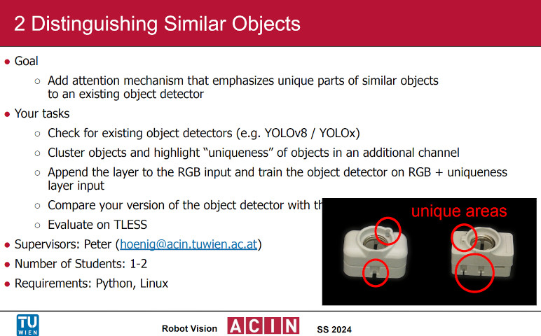

# Distinguishing Similar Objects

This repository aims to include all code and documentation to replicate the result of 2024s Course "376.055, Robot Vision - Select Topics" Task 2 - Distinguishing Similar Objects of TU Wien. 

# SOTA Research

All found literatur is documented in [literature.md](./documentation/literature.md).

# Setup

## Dependencies:
If using Python > V.3.8, a separate virtual environment for the BOP Toolkit is required, as described in Step 2.

If using Python <= 3.8 only one virtual environment is required.

## Setup for Ubuntu 22.04

Debian Packages: `unzip` `python3.10-venv` `python3-dev` `build-essential` `git` `cmake` `imagemagick`

**1. Python dependencies for this repo:**

These dependencies assume Cuda 12 and Python 3.10.

- `python3 -m venv venv`

- `source venv/bin/activate`

- `python3 -m pip install -r requirements.txt`

**2. Build BOP Toolkit Requriements:**

- Run `export BOP_PATH=<path of this repo>/dataset/tless_train_pbr/train_pbr`

- `python3.8 -m venv bop_toolkit_venv`

- `source bop_toolkit_venv/bin/activate`

- `python3 -m pip install -r third_party/bop_toolkit_venv/requirements.txt`

# Here is the manual 
Manual installation
Install venv or the virtual environment of your choice: `sudo apt-get install -y `
Run `python3 -m venv venv` to create the environment.

## Notes:
- ultralytics repository in docker image (`/usr/src/ultralytics`) is replaced with modified files.